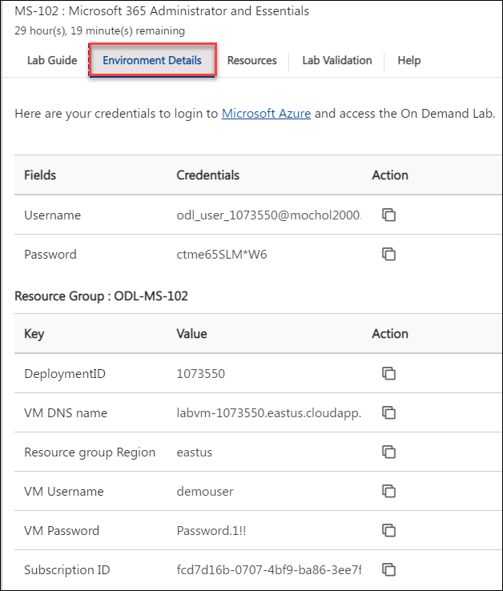
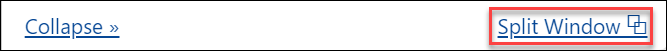
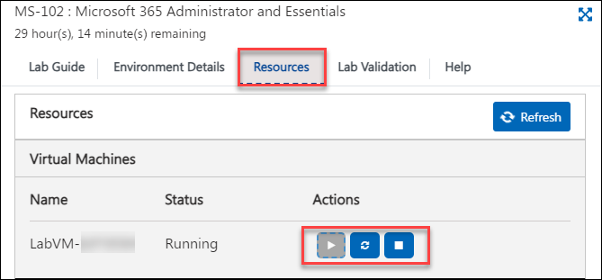

# Getting Started

1. Once the environment is provisioned, a virtual machine and lab guide will get loaded into your browser. Use this virtual machine throughout the workshop to perform the lab.

1. To get the lab environment details, you can select the **Environment Details** tab.

    

1. You can also open the Lab Guide on a separate full window by selecting the **Split Window** button from the bottom right corner.

       

1. Also, you can **Start, Restart and Deallocate** the virtual machines from the **Resources** tab.

    

1. Click on **Next** from the bottom right and follow the instructions to perform the lab.

       
