# Learning Path 1 - Lab 1 - Exercise 1 - Initialize your Microsoft 365 Tenant 

## Lab scenario

Adatum Corporation is a subsidiary of Contoso Electronics. Adatum runs its legacy applications (such as Microsoft Exchange Server 2019) in an on-premises deployment. However, it recently subscribed to Microsoft 365, thereby creating a hybrid deployment in which it must synchronize its on-premises and cloud deployments. 

As Adatum's Microsoft 365 administrator, you have been tasked with deploying Microsoft 365 in Adatum’s hybrid deployment using a virtualized lab environment. In this exercise, you will set up Adatum's Microsoft 365 trial tenant, and your instructor will guide you on how to obtain your Microsoft 365 credentials in your lab-hosted environment. You will use these credentials throughout the remaining labs in this course. 

In your lab environment, your lab hosting provider has already obtained a Microsoft 365 trial tenant for you. Your lab provider has also created two admin accounts that you will use in your VM lab environment: 

- A local administrator account for Adatum's on-premises environment (Adatum\Administrator).
- A default tenant admin account in Microsoft 365 (the display name for this user account is ODL user). 

You will log into the Client 1 PC (LON-CL1) using the local Adatum\Administrator account. When you access Microsoft 365 for the first time, you will initially log in using the Microsoft 365 tenant admin account (ODL user). You will then update Adatum's Microsoft 365 organizational profile, and you'll prepare your tenant for Microsoft Entra ID and for later labs using Information Rights Management, audit alerts, Microsoft Graph PowerShell.
 
## Task 0- Pre-requisite

1. In **Type here to search**, type **Hyper-V Manager (1)**, and select **Hyper-V Manager (2)**.

    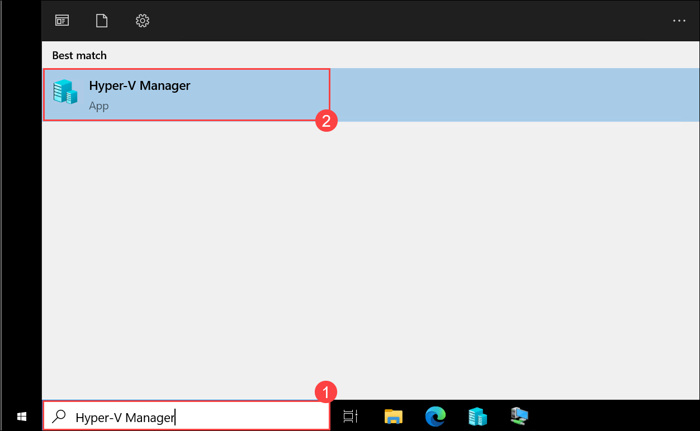

1. On the Virtual Machines section, it will show all the virtual machines that are in running state, right click on **LON-CL1 (1)** VM, select **Connect (2)**, on the **Connect to LON-CL1**, select **Connect**.

   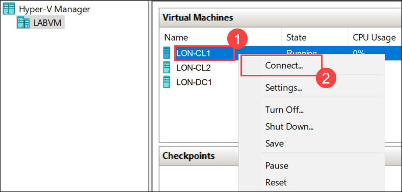

   >**Note:** If required, maximize the LON-CL1 VM.

1. Log into **LON-CL1** as the local **Administrator** account that was created by your lab hosting provider with the password **Pa55w.rd**. 

1. Open **Microsoft Edge**, in the search bar use this URL to open [Azure Portal](https://portal.azure.com/#home). On the Sign in page, enter the following credentials:-

   - Username:- <inject key="AzureAdUserEmail"></inject>
   - Password:- <inject key="AzureAdUserPassword"></inject>

   >**Note:** If a Action Required popup window appears, click **Ask Later**. 
   
   > If you see the pop-up Stay Signed in?, click **Yes**. 
   
   > If a Welcome to Microsoft Azure popup window appears, click **Maybe Later** to skip the tour.

1. In **search resources, services, and docs**, type **Microsoft Entra ID (1)** and select **Microsoft Entra ID (2)**.

    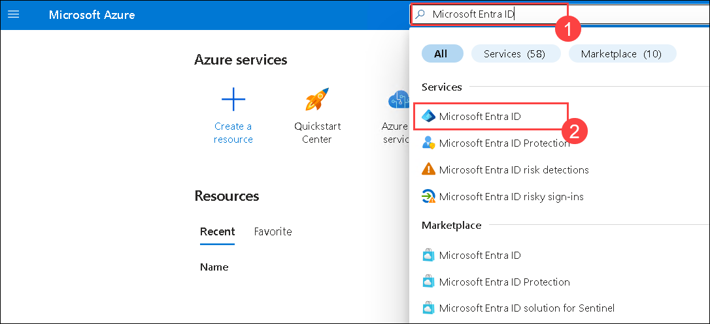

1. Under **Manage (1)** section, select **Users (2)** from the left-hand navigation pane, under **All users (3)** pane search for **Alex Wilber (4)**, and select the **Alex Wilber (5)** from the list.

    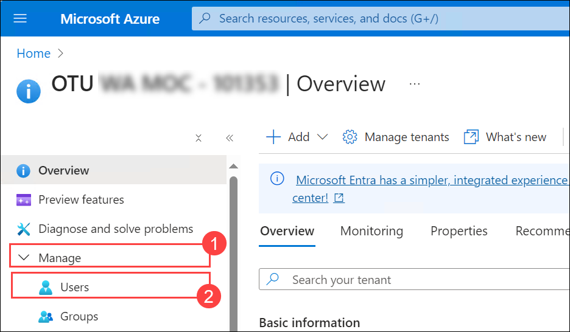

    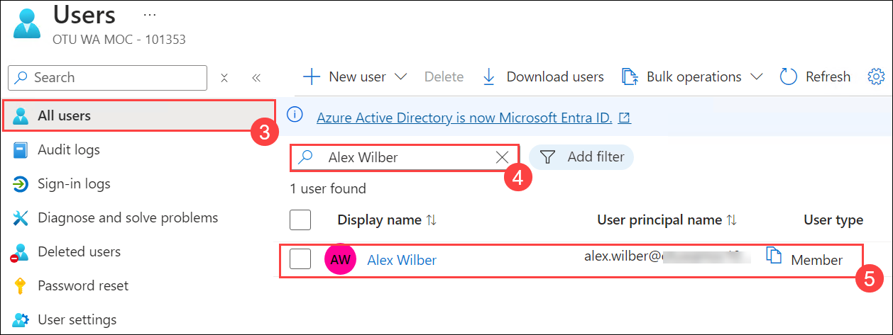

1. On the left-hand side navigation, under **Manage** section, select **Licenses (1)**, select **Go to M365 Admin center (2)**.

    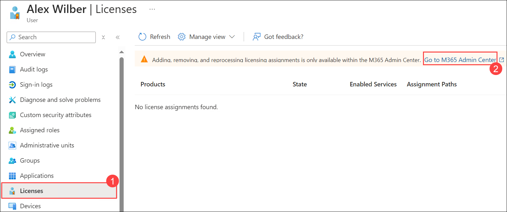

1. On the **Licenses**, under **Subscriptions (1)**, select **Enterprise Mobility + Security E5 (2)**.

    

1. On the **Enterprise Mobility + Security E5**, select **+ Assign licenses (1)**. On the **Assign licenses to users** pane, search and select for **Alex Wilber Allan Deyoung, Joni Sherman, Lynne Robbins, Diego Siciliani, Isaiah Langer, Megan Bowen, Nestor Wilke, and Patti Fernandez (2)** and select **Assign (3)**.

    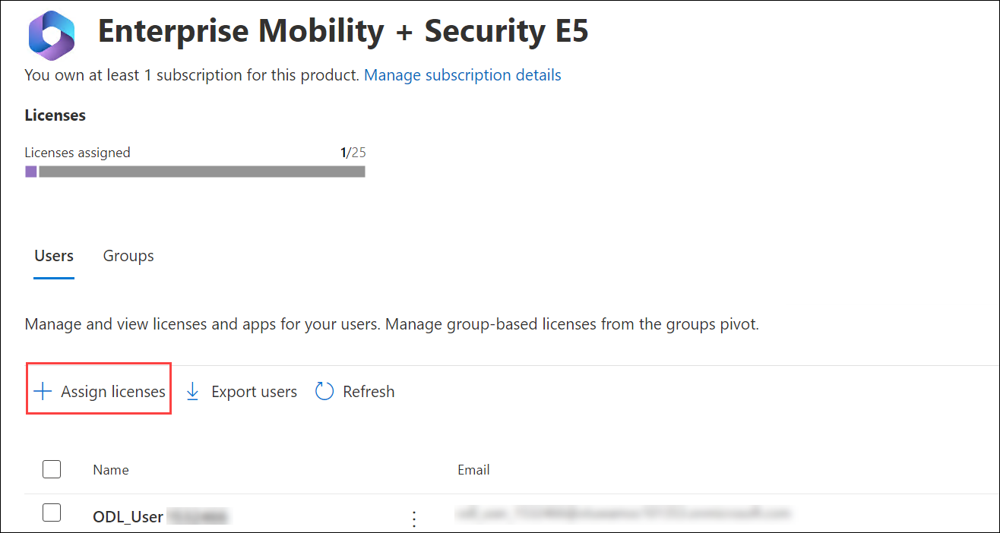

    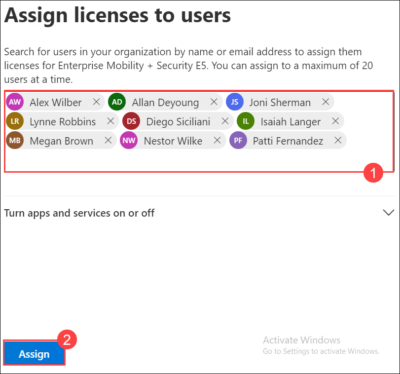

1. Close the assigned licenses pane, and close the **Microsoft 365 admin center**.

1. In **Type here to search**, type **Windows Powershell (1)**, on the **Windows Powershell (2)**, select **Run as administrator (3)**, and run the following commands to assign the usage location to all the users:

    ```powershell
    Install-PackageProvider -Name NuGet -RequiredVersion 2.8.5.201 -Force
    ```
    ```powershell
    Import-PackageProvider -Name NuGet -RequiredVersion 2.8.5.201
    ```
    ```powershell
    Install-Module -Name "AzureAD"
    ```

    >**Note:** When it asks **You are installing the modules from an untrusted repository. If you trust this repository, change its InstallationPolicy value by running the Set-PSRepository cmdlet. Are you sure you want to install the modules from 'PSGallery'? [Y] Yes  [A] Yes to All  [N] No  [L] No to All  [S] Suspend  [?] Help (default is "N"): A**, Enter **A** .
    
    ```powershell
    Install-Module AzureAD -Force
    ```

	```powershell
    Connect-AzureAD
    ```
	>**Note:** Provide the ODL credentials, on the Sign in page, enter the username **<inject key="AzureAdUserEmail"></inject>**, and enter the password **<inject key="AzureAdUserPassword"></inject>**

	```powershell
    Get-AzureADUser -All $true | Set-AzureADUser -UsageLocation US
	```

    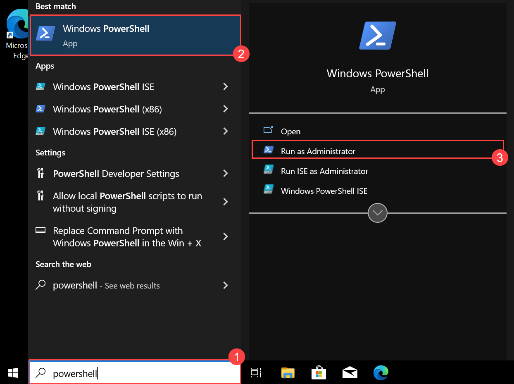

12. Close the **Windows Powershell**. Now, you can start with the Task 1.

### Task 1- Set up Adatum's Organization Profile

1. Open **Microsoft Edge**, in your Edge browser, go to the **Microsoft 365 Home** page by entering the following URL in the address bar: **https://portal.office.com** 

1. In the **Sign in** dialog box, enter the **Microsoft 365 Tenant Username**, i.e. **<inject key="AzureAdUserEmail"></inject>**, select **Next**.

1. In the **Enter password** dialog box, enter the password <inject key="AzureAdUserPassword"></inject> page in the **Microsoft 365 Tenant Password** and then select **Sign in**.

	>**Note:** If a **Action Required** popup window appears, click **Ask Later**.

1. On the **Stay signed in?** dialog box, select the **Don’t show this again** check box and then select **Yes.** On the **Save password** dialog box that appears, select **Never**.

1. If a **Welcome to Microsoft 365** dialog box appears in the middle of the screen, there's no option to close it. Instead, to the right of the window, select the forward arrow icon (**>**) two times and then select the check mark icon to advance through the slides in this messaging window. 

1. If a **Find more apps** window appears, select the **X** in the upper right-hand corner of the window to close it. 

1. The **Welcome to Microsoft 365** page appears in your Edge browser in the **Home | Microsoft 365** tab. This is the ODL user's Microsoft 365 home page.

	>**Note:** Notice the initials **O1** that appear in a circle in the top-right corner of the screen. These are the initials of the **ODL user** account, which is the tenant admin account that you just signed in as. However, when a user such as the ODL user has no picture assigned to it, the user's initials are displayed in place of the picture.

1. On the **Welcome to Microsoft 365** page, in the list of application icons that appear in the left-hand pane, select **Admin**, this opens the **Microsoft 365 admin center** in a new browser tab. 

	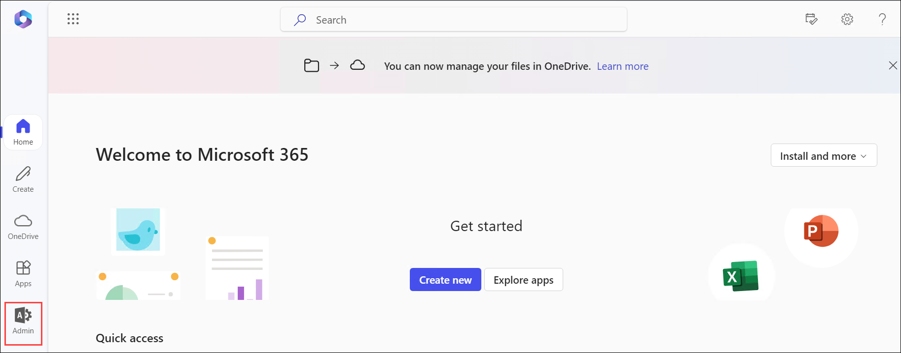

    >**Note:** On the **Business Advisor** pop-up, select **Skip for now**.

1. In the **Microsoft 365 admin center**, select **Show all** in the left-hand navigation pane and then select **Settings**. In the **Settings (1)** group, select **Org settings (2)**. 

	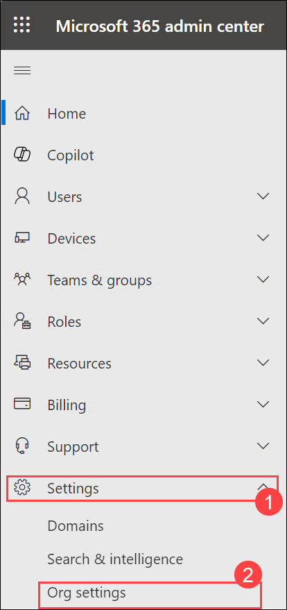

1. On the **Org settings** page, the **Services** tab is displayed by default. Select the **Organization profile** tab.

1. In the **Organization profile** tab, select **Organization information** from the list of profile data.

	

1. In the **Organization information** pane that appears, enter the following information:

    - Name: **Adatum Corporation**

    - Street Address: **555 Main Street**

    - City: **Redmond**

    - State or province: **Washington**

    - ZIP or postal code: **98052**

    - Phone: Keep it as Default

    - Technical contact: Keep it as Default

    - Preferred language: **English**

1. Select **Save**.

1. At the top of the **Organization information** pane, note the message indicating the **Saved**. Select the **X** in the upper right-hand corner to close the pane.

1. Back on the **Organization profile** tab, in the list of organization profile data, select **Release preferences**.

    >**Note:** One of the benefits of Microsoft 365 is its ability to have the latest features and updates automatically applied to your environment. This process can reduce maintenance costs and overhead for an organization and allow early-adopter users to test new features. By setting up your **Release preferences**, you can control how and when your Microsoft 365 tenant receives these updates.

    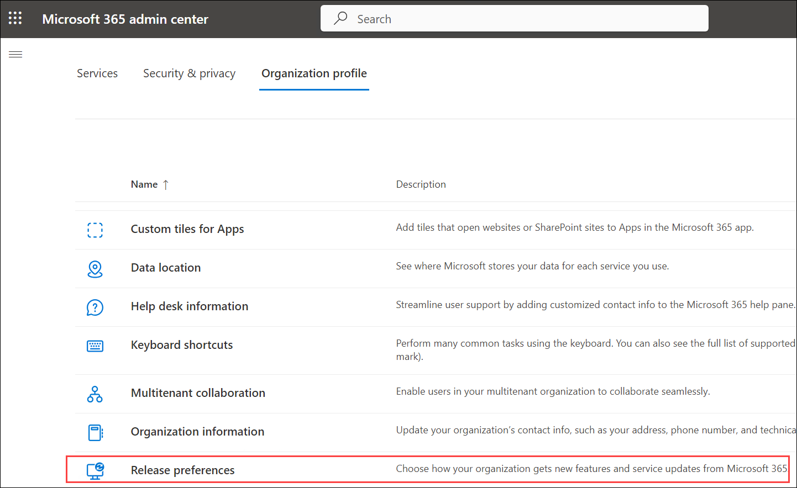

1. In the **Release preferences** pane that appears, select the **Targeted release for select users** option and then select **Save**.

	>**Note:** the **Targeted release for select users** option enables you to create a control group of users who will preview updates so that you can prepare the updates for your entire organization. The **Targeted release for everyone** option is more commonly used in development environments, where you can get updates early for your entire organization. In non-development environments, such as Adatum, targeted release to a select group of users is a more typical preference as it enables an organization to control when it wants to make updates available to everyone once they've been reviewed by the control group.

	

1. In the **Release preferences** pane, below the list of release options, select the **Select users** option.

    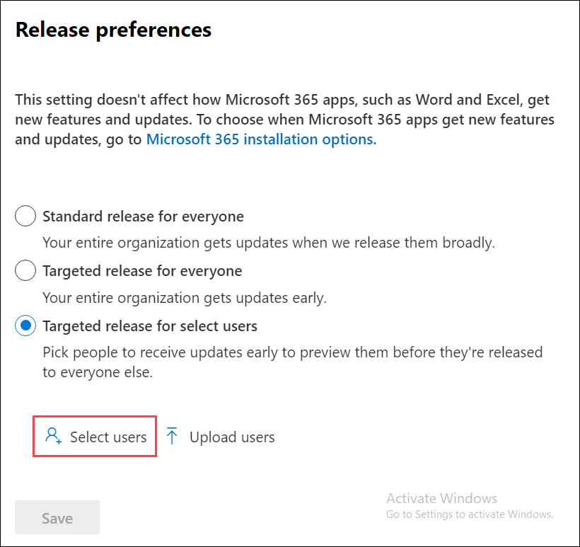

1. In the **Choose users for targeted release** pane that appears, select inside the **Who should receive targeted releases?** field. In this list, select each of the following users.

    >**Note:** You must select each **User (1)**, one at a time. After selecting a user, you must select inside the **Who should receive targeted releases?** field again to re-display the list so that you can select the next user. 

	- **Alex Wilber**
	- **Joni Sherman**
	- **Lynne Robbins**
	- **ODL_User <inject key="DeploymentID" enableCopy="false"/>**

	>**Note:** Alex, Joni, and Lynne are part of Holly's Microsoft 365 pilot team. Their accounts will be used throughout the labs for this course.
    
1. Select **Save (2)**.

    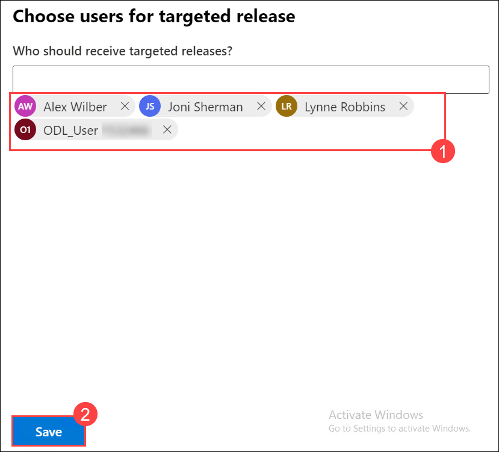

1. At the top of the **Release preferences** pane, note the message indicating the 4 users were added to the targeted release. Select the **X** in the upper right-hand corner to close the pane. 

1. Remain logged into **LON-CL1** with Microsoft Edge open to the **Microsoft 365 admin center** for the next task.

### Task 2- Create a custom theme for Adatum's pilot project team 

1. In the **Microsoft 365 admin center**, select **Teams & groups (1)** in the left-hand navigation pane, and then under it, select **Active teams & groups (2)**. 

    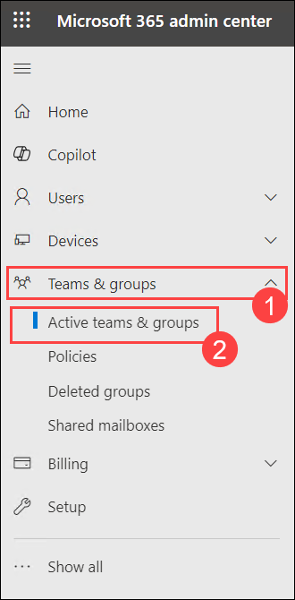

1. In the **Active teams and groups** page, there's a tab for viewing each of the group types. This tab displays the existing **Teams & Microsoft 365 groups (1)**. Select the **+ Add a Microsoft 365 group (2)** option that appears on the menu bar. This initiates the **Add a Microsoft 365 group** wizard. 

	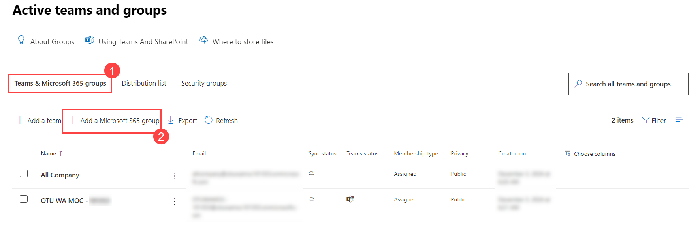

1. In the **Set up the basics** page, enter **M365 pilot project (1)** in the **Name** field, and then enter **Members of the Microsoft 365 pilot project team (2)** in the **Description** field (Note: even if you don't enter a description, you must still select into this field to enable the **Next** button). Select **Next (3)**.

	

1. You will now assign the ODL user as owner of the **M365 pilot project** group. In the **Assign owners** window, select **+ Assign owners**.
	
1. In the **Assign owners** pane that appears, select the check box next to **odl_user <inject key="DeploymentID" enableCopy="false"/> (1)**, and then select the **Add (2)** button at the bottom of the pane.

	

1. On the **Assign owners** page, **ODL user (1)** should appear as owner of the group. Select **Next (2)**.

    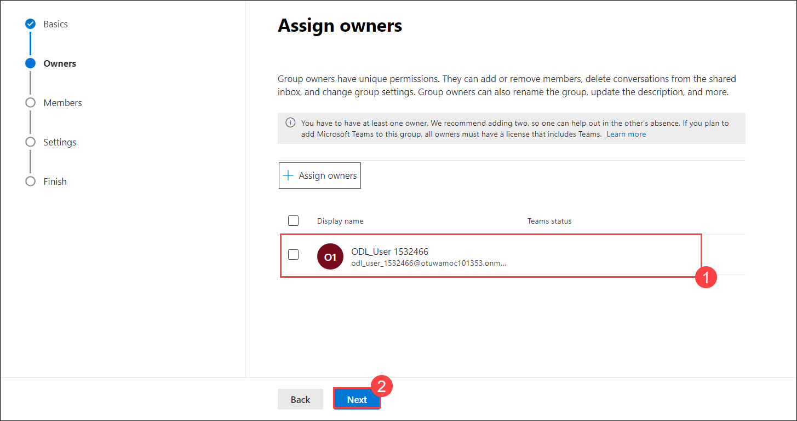

1. You will now assign members to the M365 pilot project group. In the **Add members** page, select **+ Add members**.

1. In the **Add members** pane that appears, select the check boxes next to the following users: **Alex Wilber**, **Allan Deyoung**, **Diego Siciliani**, **Isaiah Langer**, **Joni Sherman**, **Lynne Robbins**, **Megan Bowen**, **ODL user**, **Nestor Wilke**, and **Patti Fernandez**. Then select the **Add (10)** button at the bottom of the pane.

    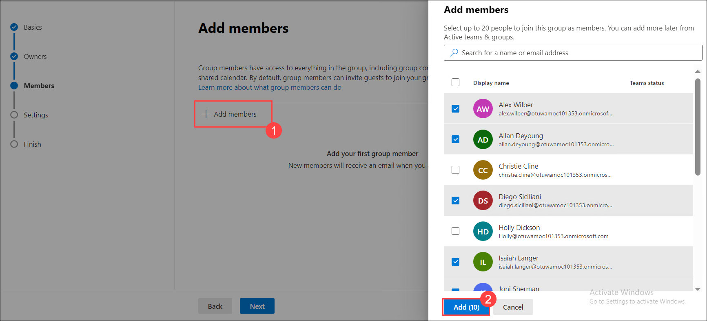

1. On the **Add members** page, verify all the 10 users are listed as members of the group. If you missed a user, select **+ Add members** and then add any users that you missed. When all 10 users appear on this page, select **Next**.

1. In the **Edit settings** page, enter the following information:

	- Enter **m365pilotproject** in the **Group email address** field.
	- In the **Privacy** field, select **Private**.

1. In the **Review and finish adding group** page, review the content that you entered. If anything needs to be fixed, select **Edit** under the specific area that needs adjustment, make any necessary corrections, and then select **Next** to continue back to this page. Once everything is correct, select **Create group**.

    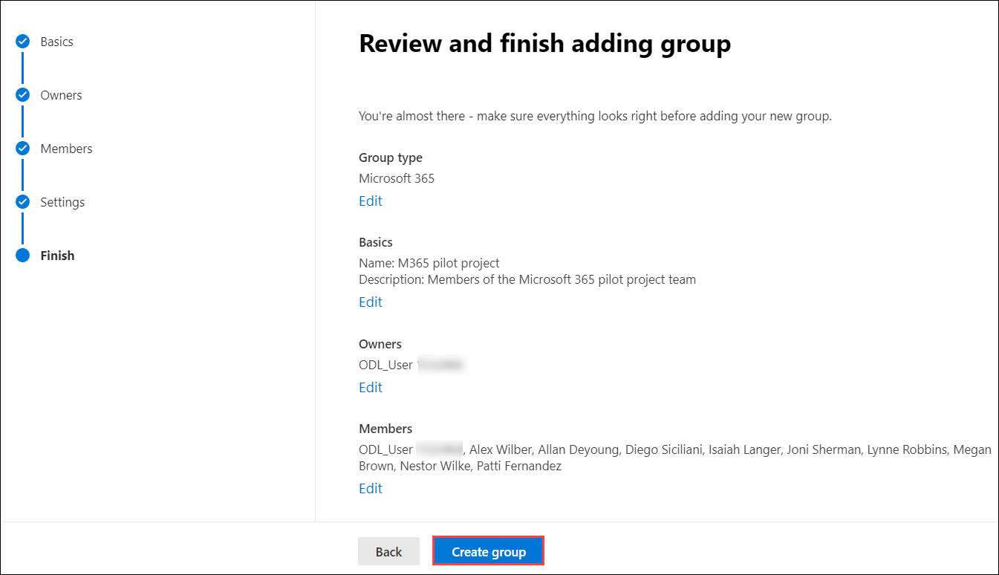

1. Once the **M365 pilot project group created** window appears, note the comment at the top of the page that it may take 5 minutes for the new group to appear in the list of Active groups. Select **Close**.

    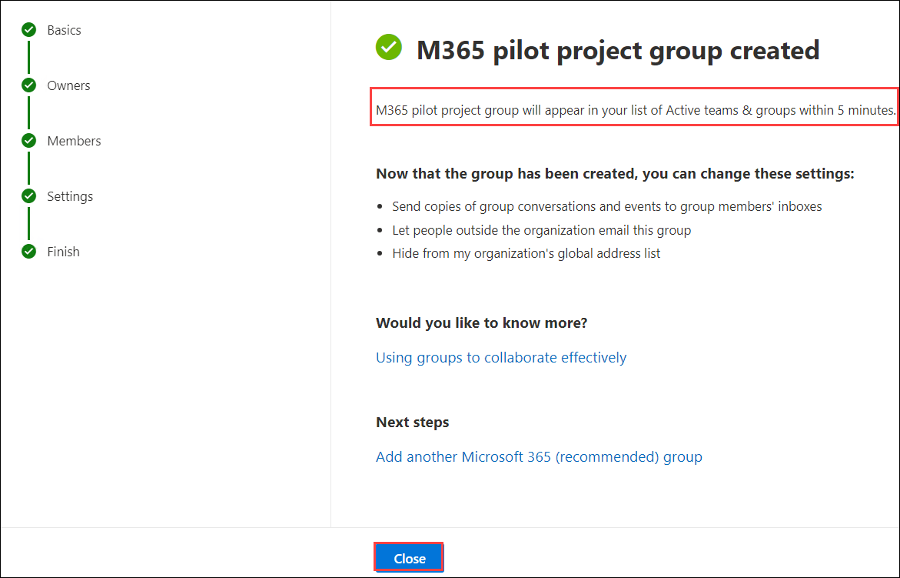

1. This returns you to the **Active teams and groups** page, which should display the **Teams & Microsoft 365 groups** group tab. Since the M365 pilot project group was a Microsoft 365 group, it should eventually display on this tab. If necessary, select the **Refresh** option on the menu bar until you see the M365 pilot project group in the list of Teams & Microsoft 365 groups.

1. In the **Microsoft 365 admin center**, under the **Settings** group in the navigation pane, select **Org settings**. 

1. On the **Org settings** page, select the **Organization profile** tab.

1. In the list of **Organization profile (1)** data, select **Custom themes (2)**.

	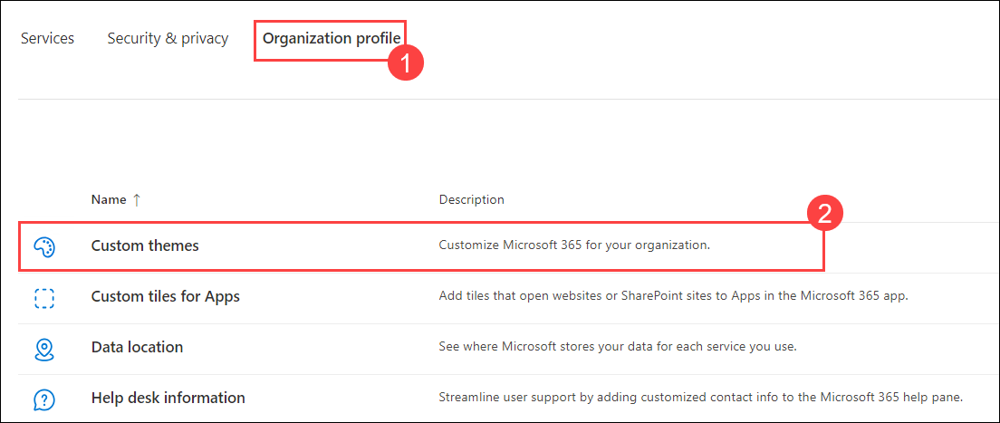

1. In the **Customize Microsoft 365 for your organization** pane that appears, you can customize the default theme that users see when signed into Microsoft 365, and you can add additional custom themes. Select the **+ Add theme** option.

1. In the **Customize Microsoft 365 for your organization** pane that appears, notice how it displays the **Default theme**. Select the **Default theme**. 

1. On the **Default theme** pane, notice how the **Show the user's display name** option is not selected. Select that check box, and **Save it**. Select the back arrow at the top of the pane to return to  the **Customize Microsoft 365 for your organization** pane.

	>**Note:** Holly decides to make the **Show the user's display name** option a permanent feature, she selected this option in the **Default theme** pane so that it applies to all Adatum users.

1. In the **Customize Microsoft 365 for your organization** pane that appears, you can customize the default theme that users see when signed into Microsoft 365, and you can add additional custom themes. Select the **+ Add theme** option.

1. In the **New group theme** pane that appears, the **General** tab is displayed by default. Enter **M365 pilot project theme** in the **Name** field.

1. Select inside the **Groups** field. In the list of groups that appears, select **M365 pilot project** if it appears in the list of groups.

	>**Note:** If **M365 pilot project** doesn't appear in the list of groups, then enter **M365** in the **Groups** field. A search results box should appear that displays the **M365 pilot project** group. Select **M365 pilot project**. 

1. Select the **Show the user's display name** check box. This is the setting that Holly wants to customize for the M365 pilot project team members.
 
1. Select the **Logos** tab and take some time to review its options. Do the same for the **Colors** tab. Note the various theme and branding options that are available for you to update.

	>**Note:** For the purpose of this lab, you can change any of the options or leave the default values as is. For example, in your real-world environment, you can add the logo of your company and set the background image as the default for all your users. For this lab, feel free to change the colors for your navigation pane, text color, icon color, and accent color. 

	**Go ahead and explore the different options for this theme that will be used by the Microsoft 365 pilot project team members. Make any changes that you wish.** 

	>**Tip:** Some color patterns aesthetically distract users. If you do change any of the colors, it's recommended that you avoid using high contrasting colors together, such as neon colors and high-resolution colors like bright pink and white.

1. Select **Save**. Close the **M365 pilot project theme** pane once your changes are saved. 

1. Select the **Refresh** icon at the top of the screen, to the left of the address bar. Once the screen refreshes, note how the **ODL user** name appears to the left of the circle with the **O1** initials. The signed-in user's name now appears to the left of their profile picture or initials due to the custom theme that you just created.

1. In the list of organization profile data, select **Custom themes**. Close the **Customize Microsoft 365 for your organization** pane.

1. Remain logged into **LON-CL1** with Microsoft Edge open to the **Microsoft 365 admin center** for the next task.

### Task 3 - Enable Information Rights Management for SharePoint Online  

>**Important:** While you will validate IRM for Exchange and SharePoint in Lab 7, you must enable IRM for SharePoint Online now because it can take up to 60 minutes or more for IRM to show up in SharePoint Online. By the time you get to the validation exercise in Lab 7, IRM should have finished its internal configuration and you won’t have to wait for it to be present in SharePoint Online. Keep this time issue in mind if you plan to enable IRM in your real-world deployment. 

1. In the **Microsoft 365 admin center**, select **Show all** in the left-hand navigation pane to see all the navigation options. Under the **Admin centers** group, select **SharePoint**. This will open the **SharePoint admin center** in a new tab.

1. In the **Welcome to your new home page** window, select **Take the tour**.

1. In the **SharePoint admin center**, in the left-hand navigation pane, select **Settings**. 

1. At the bottom of the **Settings** page is a sentence that says **Can’t find the setting you’re looking for? Go to the classic settings page.** In this sentence, select the hyperlinked text that says: **classic settings page**.

    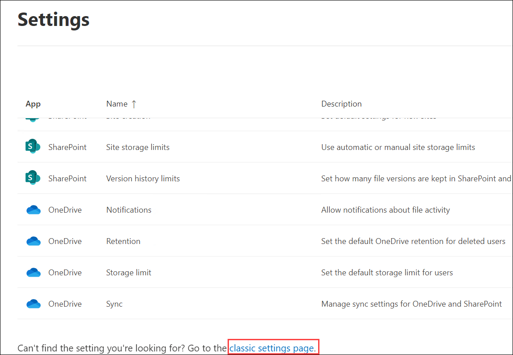

1. On the classic **Settings** page, scroll down to the **Information Rights Management (IRM)** section. In the options to the right of this section, select the **Use the IRM service specified in your configuration (1)** option, and then select the **Refresh IRM Settings (2)** button.

    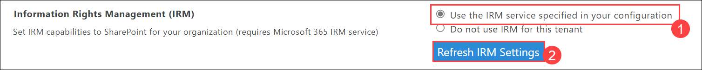

1. Scroll to the bottom of the page and select the **OK** button. 

1. Once the changes have been saved, you will be returned to the top of the **Settings** page. In your browser, close the current tab that you're on. This will return you to the **Settings** page in the **SharePoint admin center**.

1. Close this **SharePoint admin center** tab in your Edge browser. Leave the other tabs open in your browser for the next task.

> **Congratulations** on completing the task! Now, it's time to validate it. Here are the steps:
> - If you receive a success message, you can proceed to the next task.
> - If not, carefully read the error message and retry the step, following the instructions in the lab guide. 
> - If you need any assistance, please contact us at labs-support@spektrasystems.com. We are available 24/7 to help you out.

<validation step="8c9fc7ff-176c-47b4-9729-0df4c4ad6dde" />


### Task 4 – Turn on Audit Logging to enable Alert Policies 

1. In the **Microsoft 365 admin center**, under the **Admin centers** section in the left-hand navigation pane, select **Security**. This will open the **Microsoft 365 Defender** portal in a new tab in your browser.

1. In the **Microsoft 365 Defender** portal, scroll down towards the bottom of the left-hand navigation pane and select **Audit (1)**.

1. In the **Audit** window, wait a minute or so to see if a banner appears towards the top of the page that says: **Start recording user and admin activity (2)**. If this banner appears, then auditing is NOT turned on for your organization. This banner is your prompt to turn on audit logging.

	>**Note:** Select this banner now to turn on audit logging, and on the **Security** pop-up select **Yes**, and if it says **We're updating your organization to support customization. Please allow 24 to 48 hours before you retry this operation.**, select **OK**.

    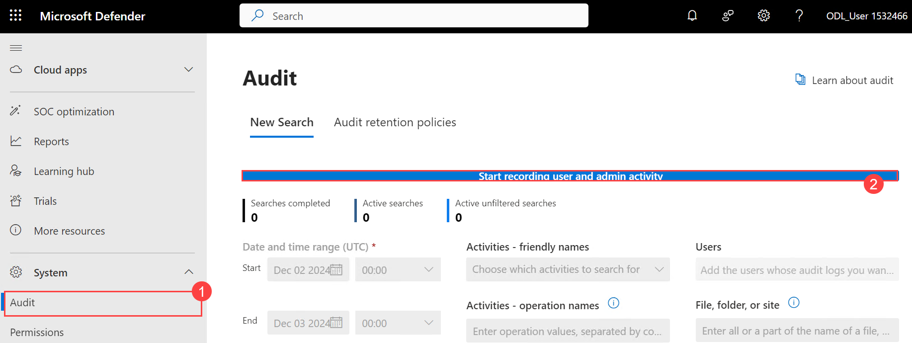

1. In the **Audit** window, the banner will disappear once audit logging is turned on. In a later lab, you will return to this page to view audited activities that you completed during your lab work.  
 
1. Close the **Microsoft 365 Defender** tab in your Edge browser. Leave your browser open and proceed to the next task. 


### Task 5 – Install Microsoft Graph PowerShell   

1. On LON-CL1, you must open an elevated instance of **Windows PowerShell**. Type **power** in the Search box that appears in the bottom left corner of the taskbar. In the list of search results, right-click on **Windows PowerShell** (do not select Windows PowerShell ISE) and select **Run as administrator** in the drop-down menu that appears. 

2. Maximize your PowerShell window. In **Windows PowerShell**, type the following command at the command prompt to install the Microsoft Graph PowerShell module from the PowerShell Gallery and then press Enter:
	```powershell
    Install-Module Microsoft.Graph -Scope CurrentUser
    ```

3. You will be prompted to confirm whether you want to install the module from an untrusted repository (PSGallery). Enter **A** to select **[A] Yes to All** and then press Enter.  

    >**Note:** Your response will initiate the installation of all the Microsoft Graph sub-modules. Once all the installation messages (for each sub-module) have finished displaying, it will still take approximately 5 to 10 minutes to complete the Microsoft Graph PowerShell installation. During this time, the cursor will continue to blink below the untrusted repository message. This may be a good time to take a short break.

4. A command prompt will appear once Microsoft Graph PowerShell has been installed. Run the following command to see the complete list of sub-modules that were installed under the Microsoft.Graph primary module:  
	
	```powershell
    Get-InstalledModule Microsoft.Graph.* 
    ```

	>**Note:** The labs that use Microsoft Graph PowerShell in this course will use the following sub-modules: Microsoft.Graph.Identity.DirectoryManagement, Microsoft.Graph.Users, and Microsoft.Graph.Groups. To access the cmdlets for a sub-module, you must first import the sub-module. You can either import all 30+ sub-modules at one time using the "Import-Module Microsoft.Graph" command, or you can import each module that's needed to perform whatever function you're doing (for example, "Import-Module Microsoft.Graph.Users" to perform user maintenance) at a particular point in time. For the purpose of this training, since the later lab exercises will only use three sub-modules, you will NOT import all 40+ sub-modules now. Instead, you will wait to import these three sub-modules when they're needed in later labs. Proceed to the next step. 

5. PowerShell's execution policy settings dictate what PowerShell scripts can be run on a Windows system. Setting this policy to **Unrestricted** enables Holly to load all configuration files and run all scripts. At the command prompt, type the following command, and then press Enter:
	
	```powershell
	Set-ExecutionPolicy unrestricted
	```
6. If you are prompted to verify that you want to change the execution policy, enter **A** to select **[A] Yes to All.** 

6. Do **NOT** close your PowerShell window. Leave the Windows PowerShell window open but minimize it for now. Remain logged into LON-CL1 and keep your Edge browser open.

## Review

In this lab, you have:

- Learnt how to set up Adatum's Organization Profile.
- Created a custom theme for Adatum's pilot project team.
- Learnt how to enable Information Rights Management for SharePoint Online.
- Explored how to turn on Audit Logging to enable Alert Policies.
- Installed Microsoft Graph PowerShell.


## Proceed to the next exercise.
