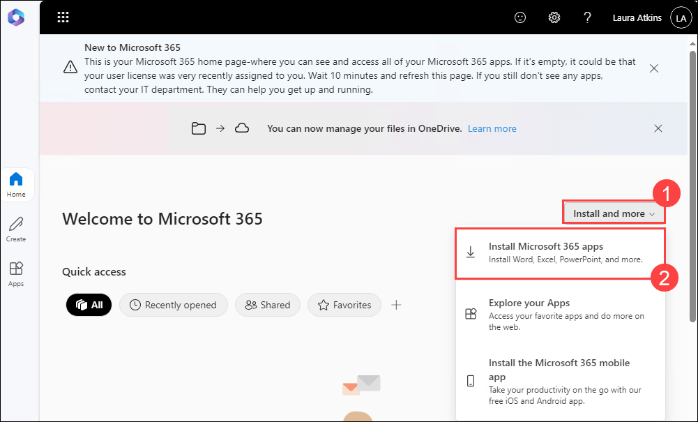
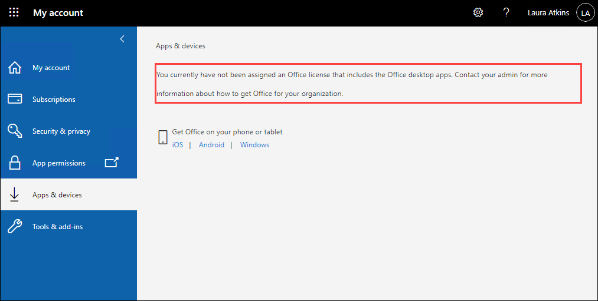
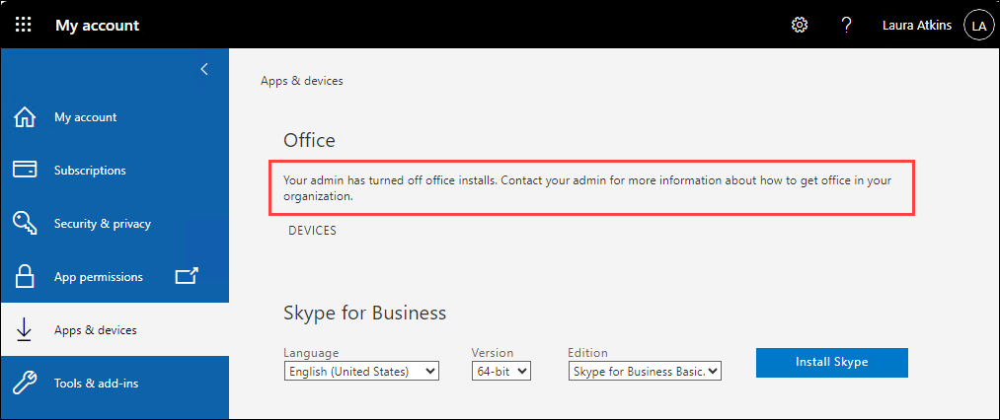
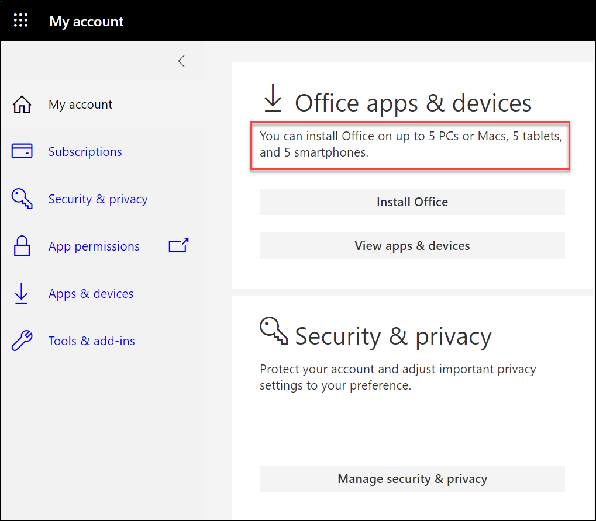

# Learning Path 2 - Lab 2 - Exercise 3 - Manage a Microsoft 365 Apps for enterprise installation

## Lab scenario

You have taken on the persona of Holly Dickson, Adatum's new Microsoft 365 Administrator, and you have Microsoft 365 deployed in a virtualized lab environment. In this exercise, you will perform the tasks necessary to manage a user-driven Microsoft 365 Apps for enterprise installation. Performing a user-driven Microsoft 365 Apps for enterprise installation is a two-step process: 

- Configuring the user account so the user is eligible to download and install the Office 365 deployment tool.
- Performing the installation. 

In the first two tasks in this exercise, you will verify the following conditions that affect whether a user can be blocked from downloading the Microsoft 365 Apps for enterprise suite: 

- Whether the user has an appropriate Microsoft 365 license (which you will verify in Task 1). 	
- Whether an admin has turned off the global Office download setting that controls the downloading of mobile and desktop apps for all users (which you will verify in Task 2).

In the final task in this exercise, you will install the Microsoft 365 Apps for enterprise suite for one of Adatum's users.

### Task 1 – Verify how licensing affects installing Microsoft 365 Apps for enterprise

1. On LON-CL1, you should be logged into Microsoft 365 as Holly Dickson in your Edge browser. 

1. In the **Microsoft 365 admin center**, in the navigation pane, select **Users** and then select **Active users**. 

1. You will begin by testing whether a user **without** an appropriate Microsoft 365 license can install Microsoft 365 Apps for enterprise. For this test, you will use **Laura Atkins**. Your lab hosting provider has already created an on-premises user account for Laura, but she does not have a Microsoft 365 user account. You will create a Microsoft 365 account for Laura, but you will NOT assign her a Microsoft 365 license.

	At the top of the **Active users** window, select **Add a user** on the menu bar. Doing so initiates the **Add a user** wizard.

1. In the **Add a user** wizard, in the **Set up the basics** window, enter the following information:
	- First name: **Laura**
	- Last name: **Atkins** 
	- Display name: When you tab into this field, **Laura Atkins** will appear
	- Username: **Laura**
	- Password settings: Clear (uncheck) the **Automatic create a password** option
	- Password: Enter the enter Password:- <inject key="AzureAdUserPassword"></inject>.
	- Clear (uncheck) the **Require this user to change their password when they first sign in** check box 
	- Select **Next**.

1. In the **Assign product licenses** window, select the **Create user without product license (not recommended)** option, and then select **Next**.

1. In the **Optional settings** window, select **Next**. 

1. On the **Review and finish** window, review your selections. If anything needs to be changed, select the appropriate **Edit** link and make the necessary changes. Otherwise, if everything looks good, select **Finish adding**. 

1. On the **Laura Atkins added to active users** page, select **Close**. If a survey form appears, select **Cancel**. 

1. Minimize the **LON-CL1** VM, on the **Hyper-V Manager** page, right click on **LON-CL2**, and select **Turn-off** option, it will turn-off your VM, as you can see the state of the **LON-CL2** VM is showing as **Off**. Now, right click on the **LON-CL2** VM, select **Start** button, and see the VM is now in running state. Again right click on the Client-2 VM (LON-CL2) and select **Connect**, and select **Connect**.

	>**Note:** if the **Connect to LON-CL2** pop-up appears select **Connect**.

1. On **LON-CL2**, you want to log into the machine as **Laura Atkins**. the desktop displays the **Admin** and **Other user** options. Select **Other user**. Since you want to log on to the LON-CL2 machine using Laura Atkins's local account (adatum\laura).

1. In the **Other user** log in, enter **adatum\laura** in the **Username** field, enter **Pa55w.rd** as the **Password**, and then select the forward arrow to log in.  

1. Select the **Microsoft Edge** icon on the taskbar.

1. In **Microsoft Edge**, maximize your browser if necessary. If you receive a **Welcome to Microsoft Edge** window that displays a message indicating **Let's start by signing you in and bringing over your passwords, history, and more**, perform the following steps to initialize your Edge browser and navigate to the Microsoft 365 Home page:  

	- On the first screen, select the **Start without your data** button.
	
	- On the second screen, select the **Continue without this data** button.
	
	- On the third screen, unselect (clear) the **Make your Microsoft experience more useful to you** check box and then select the **Confirm and start browsing** button.  
	
	- In the Edge browser, go to the **Microsoft 365 Home** page by entering the following URL in the address bar: **https://portal.office.com/**

1. In the **Sign in** window, enter **Laura@otuwamoc<inject key="DeploymentID" enableCopy="false"/>.onmicrosoft.com** (where otuwamoc<inject key="DeploymentID" enableCopy="false"/> is the tenant prefix provided by your lab hosting provider), and then select **Next**.

1. In the **Enter password** window, For the password, sign-in with the same **Microsoft 365 Tenant Password**.
	
	- Password:- <inject key="AzureAdUserPassword"></inject> and then select **Sign in.**

	>**Note**: if it asks you to change the password, then change the password for the laura's account.

1. In the **Stay signed in?** window, select the **Don't show this again** check box and then select **Yes**. In the **Save password** window, select **Never**.

1. In the **Welcome to Microsoft 365** dialog box that appears in the middle of the screen, select the forward arrow twice and then the check mark. 

1. In the **Welcome to Microsoft 365** window (which is Laura's Microsoft 365 home page), notice that no column of Microsoft 365 app icons appears in the navigation pane on the left-side of the screen. This is because Laura has not been assigned a Microsoft 365 license. Select the **Install and more (1)** button, and then in the drop-down menu that appears, select **Install Microsoft 365 apps (2)**. This opens the **My account** window for Laura.

	

1. In Laura's **My account** window, under the **Office apps & devices** tile, select **View apps & devices**. Note the message that appears at the top of page. Laura has not been assigned a license that includes the Office desktop apps, so she’s unable to install Microsoft 365 Apps for enterprise. 

	
	
	>**Important:** You have just verified that a user can't download Microsoft 365 Apps for enterprise if they haven't been assigned an appropriate Microsoft 365 license. 
	
1. Leave LON-CL2 open and remain signed into Microsoft 365 as Laura Atkins for the next task. In your Edge browser, close the **My account** tab and the **Welcome to Microsoft Edge** tab, but leave the **Home | Microsoft 365** tab open for the next task.

### Task 2 – Verify how the global Office download setting affects installing Microsoft 365 Apps for enterprise

Microsoft 365 includes a global Office download setting that controls the downloading of mobile and desktop apps for all users. Holly is now going to test whether users can be prohibited from downloading Microsoft 365 Apps for enterprise if an admin turns off this setting. In this test, Holly will once again use Laura Atkins as her test case. However, since you just proved in the prior task that Laura can't install Microsoft 365 Apps for enterprise without a proper license, you must first assign her a license. 

**License Note:** If you recall from the earlier lab exercise when you created Holly Dickson's Microsoft 365 account, there were no available Microsoft 365 Business Premium or Enterprise Mobility + Security E5 licenses available. As such, you had to first unassign one of each license from an existing user so that you could assign them to Holly. The same situation exists here with Laura. You must first unassign one of each license from an existing user so that you can assign them to Laura.
	
1. Switch back to **LON-CL1**(by going on to the hyper-v manager). In your Edge browser, you should still be logged into Microsoft 365 as Holly Dickson, Adatum’s Microsoft 365 Administrator.

2. On **LON-CL1**, Holly wants to turn off the global Office download setting. To do so, select the **Microsoft 365 admin center** tab in your browser, and then if necessary, select **...Show all** in the navigation pane. Select **Settings**, and then within the Settings group, select **Org Settings**. 

3. In the **Org settings** window, the **Services** tab is displayed by default. Scroll down through the list of services and select **Microsoft 365 installation options**.

4. In the **Microsoft 365 installation options** pane that appears, the **Feature Updates** tab is displayed by default. Select the **Installation** tab that appears next to it. Then under the **Apps for Windows and mobile devices** section, the **Office (includes Skype for Business)** check box is currently selected. Select this check box to clear it. This disables the ability of users to download Office apps through Microsoft 365 Apps for enterprise. 

5. Select **Save**. 

6. At the top of the **Microsoft 365 app installation options** pane, select the **X** in the upper-right corner of this window to close it. 

7. You should now test whether turning off this global download setting affects a **licensed** user from installing Microsoft 365 Apps for enterprise. In this case, you’re once again going to use **Laura Atkins**, so you must assign Laura a Microsoft 365 license. However, since there are no available licenses, you must first unassign a license from an existing Microsoft 365 user account. In this case, Holly will unassign Pradeep Gupta's licenses, since he has taken on a new role and will no longer be involved in Adatum's Microsoft 365 pilot project.  

	>**Note:** If **Pradeep Gupta** indicates **Unlicensed** then jump onto the Step-9.

9. In the **Microsoft 365 admin center** navigation pane, select **Users** and then select **Active users**. On the **Active users** page, select **Pradeep Gupta**.

8. In the **Pradeep Gupta** pane that appears, the **Account** tab is displayed by default. Select the **Licenses and apps** tab. Under **Licenses**, select the **Microsoft Business Premium** check box to clear it, and then select **Save Changes**. Close the **Pradeep Gupta** pane. The licenses that were previously assigned to Pradeep are now available for Laura.  

9. In the **Active users** list, scroll down to **Laura Atkins**. The value in the **Licenses** column for Laura currently indicates that she is **Unlicensed**. Select **Laura Atkins**.

10. In **Laura Atkins** account pane, select the **Licenses and apps** tab. In the **Licenses** section, select the **Microsoft 365 Business Premium** check boxes and then select **Save changes**. Once the changes are saved, close Laura’s account pane. In the **Active users** list, note how the value in the **Licenses** column for Laura now displays **Microsoft 365 Business Premium**. 

11. You should now check whether Laura can download Microsoft 365 Apps for enterprise to her client PC when the global Office download setting has been turned Off. 

	>**Note:** To do this, you must first switch back to **LON-CL2**, Minimze **LON-CL1** VM, and navigate back to the hyper-v manager, right click on the **LON-CL2** VM and select **Connect**.

12. In **LON-CL2**, your Edge browser should still be open, and you should still be logged into Microsoft 365 as Laura Atkins (verify Laura's **LA** initials appear in the upper-right corner of the browser; note that Laura's name doesn't appear because she's not a member of the M365 pilot project group that was assigned to the custom theme). In your browser, verify you're on the **Home | Microsoft 365** tab. When you left off after the prior lab task, this page didn't display any Microsoft 365 apps in the navigation pane on the left because Laura wasn't assigned a Microsoft 365 license. Let's see what happens now that Laura has been assigned a license. 

13. Select the **Refresh** icon that appears to the left of the address bar at the top of your browser. After refreshing the page, notice the Microsoft 365 app icons that now appear on the left-side of the screen because Laura has been assigned a Microsoft 365 license. 

	>**Note:** If a **Find more apps** window appears, select the **X** to close it.

13. Select the **Install and more** button, and then in the drop-down menu, select **Install Microsoft 365 apps**.
	
14. This will open Laura's **My account** window. Under the **Office apps & devices** tile, select **View apps & devices**. 

15. In the **Apps & devices** window, a message is displayed under the **Office** section that indicates the admin has turned off Office installs. 
	
	>**Important:** You have just verified that a licensed user is unable to download Microsoft 365 Apps for enterprise if the global Office download setting has been turned Off.

	

16. At this point Holly wants to turn the global Office download setting back On so that Laura can download Microsoft 365 Apps for enterprise. 

	>**Note:** To do this, switch back to **LON-CL1**. 

17. On **LON-CL1**, you should still be logged into Microsoft 365 as Holly Dickson. In the **Microsoft 365 admin center**, under the **Settings** section in the navigation pane, select **Org Settings**. 

18. In the **Org settings** window, the **Services** tab is displayed by default. Scroll down through the list of services and select **Microsoft 365 installation options**.

19. In the **Microsoft 365 installation options** pane, select the **Installation** tab, then under the **Apps for Windows and mobile devices** section, the **Office (includes Skype for Business)** check box is currently blank. Select this check box so that it displays a check mark, which now turns this feature back On.

20. Select **Save**, and then once the update has been saved, select the **X** in the upper-right corner of this window to close it. 

21. Now that this global Office download option is turned back On, you should see if it affects Laura’s ability to download Microsoft 365 Apps for enterprise. 

	>**Note:** To do this, switch back to **LON-CL2**.

22. In **LON-CL2**, your Edge browser should still be open, and you should still be logged into Microsoft 365 as Laura Atkins. The **Office apps and devices** page should be displayed along with the message that indicated your admin has turned off Office installs. Since you just turned this global option back On, you need to refresh this page to see how it affects Laura’s ability to download Microsoft 365 Apps for enterprise. Select the **Refresh** icon that appears to the left of the address bar at the top of your browser. 

23. In the **My account** window that appears, under the **Office apps & devices** tile, an **Install Office** button appears along with a message indicating you can install Office on up to 5 PCs or Macs, 5 tablets, and 5 smartphones.  

	
	
	>**Important:** You have just verified that a user with a Microsoft 365 license is able to download Microsoft 365 Apps for enterprise if the global Office download setting is turned On. Do **NOT** select the **Install Office** button at this time.

24. Remain on LON-CL2.

### Task 3 – Perform a User-Driven Installation of Microsoft 365 Apps for enterprise 

In the prior task, you logged into Laura Atkins client PC, and you verified that she could download Microsoft 365 Apps for enterprise once she was assigned a Microsoft 365 license and the global Office download setting was turned On. In this task, you will continue the process by having Laura perform a user-driven installation of the Microsoft 365 Apps for enterprise suite from the Microsoft 365 portal.  

1. On **LON-CL2**, your Edge browser should be open, and you should be logged into Microsoft 365 as Laura Atkins. 

1. You should still be in Laura’s **My account** window since this is where you left off at the end of the prior task. Under the **Office apps & devices** section, the **Install Office** button now appears since Laura is assigned a Microsoft 365 Business Premium license and the global Office download setting is turned On.

	>**Important:** Selecting this **Install Office** button will install the 64-bit, English version of Microsoft 365 Apps for enterprise. However, if you want to install a different language or version, then select **View apps & devices**, which opens the **Apps & devices** page; this enables you to select a different language and version of Microsoft 365 Apps for enterprise to install.
		
	>**Note:** If a **Just a few more steps** window appears, select **Close**.

1. No need to install the office, you already have the Office installed in the **LON-CL2** VM.

1. In the **Start** menu, type and select **Word**.

1. Verify that Word is functioning properly by opening a blank Word document, entering some text, and saving the document to the **Documents** folder. 

1. Close Word.

17. Now that you have completed this lab exercise, you should log out of Microsoft 365 as Laura Atkins by navigating back to the Edge browser. Select Laura's icon in the upper-right corner of the screen (the circle with LA in it), and then in Laura's property window, select **Sign out**.

18. Once Laura is signed out, close your Microsoft Edge browser. 

19. You now want to log out of LON-CL2 as Laura Atkins and log back in as the Adatum administrator. This will prepare LON-CL2 for the next lab that uses this PC. 

20. Switch back to the Hyper-V Manager, on LON-CL2, right click on the **LON-CL2** VM and turn-off the VM, after the status shows Off, right click again and start the VM. Righ click on the **LON-CL2** VM click on **Connect**. 

19. On the desktop, the **Laura Atkins** is selected by default. select **Other user**, enter **lon-cl2\admin** in the username filed and **Pa55w.rd** in the **Password** field and then select the forward arrow. The desktop should now display the logged-on user as **lon-cl2\admin**. LON-CL2 is now ready for the next lab that uses it.

> **Congratulations** on completing the task! Now, it's time to validate it. Here are the steps:
> - If you receive a success message, you can proceed to the next task.
> - If not, carefully read the error message and retry the step, following the instructions in the lab guide. 
> - If you need any assistance, please contact us at labs-support@spektrasystems.com. We are available 24/7 to help you out.

<validation step="7aa92f00-ffc8-47a4-b15b-58246027044d" />

## Review

In this lab, you have:

- Verified how licensing affects installing Microsoft 365 Apps for enterprise.
- Verified how the global Office download setting affects installing Microsoft 365 Apps for enterprise.
- Performed a User-Driven Installation of Microsoft 365 Apps for enterprise 

## You have successfully completed Lab 02. Proceed to the next exercise.
