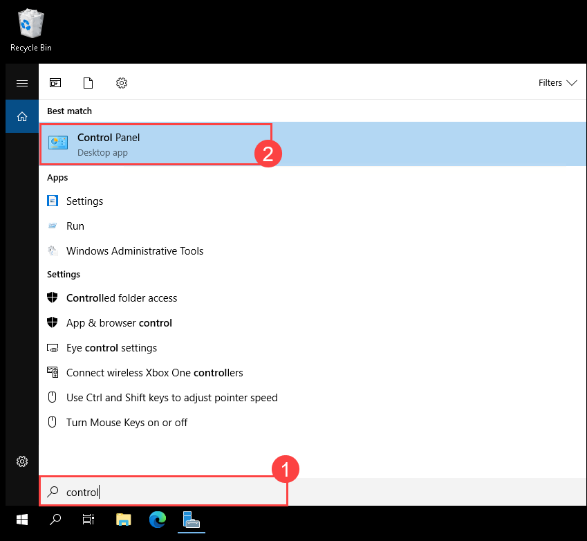

# Learning Path 3 - Lab 3 - Exercise 1 - Prepare for Identity Synchronization  

## Lab scenario

As in the previous lab exercises, you will take on the role of Holly Dickson, Adatum Corporation’s new Microsoft 365 Administrator. Adatum has recently subscribed to Microsoft 365, and you have been tasked with deploying the application in Adatum’s virtualized lab environment. In this lab, you will perform the tasks necessary to manage your Microsoft 365 identity environment using both the Microsoft 365 admin center and Windows PowerShell. 

During this exercise you will set up and manage Microsoft Entra Connect. You will create on-premises users and validate the sync process so that their identity is moved to the cloud. Some of the user and group maintenance steps may feel familiar from previous exercises; however, in this case they are needed to validate the synchronization process.

### Task 1: Prepare problem user accounts   

1. Now you'll be working on **LON-DC1** VM. To do this, you must first switch back to **Hyper-V Manager**, right click on the **LON-DC1** VM and select **Connect**, on the **Connect to LON-DC1** select **Connect**. On the desktop window **Administrator** name will display, enter the **Pa55w.rd**, and select forward arrow.

1. On your Domain Controller VM (LON-DC1), Open the Windows PowerShell, in the Windows PowerShell window, run the following command to change the root source to **C:\labfiles** so that you can access any files from that location:

	```powershell
	CD C:\labfiles\
	```

3. Enter the following command that runs a PowerShell script that creates a problem user account. This script, which is stored in the C:\labfiles folder, will purposely create an issue with the UserPrincipalName for Klemen Sic's on-premises user account; this will enable you to troubleshoot this account in the next task using the IdFix tool.  

	```powershell
	.\CreateProblemUsers.ps1
	```
	
	>**Important:** Wait until the script has finished before proceeding to the next task. This Windows PowerShell script will make the following change in AD DS:

	<!-- - **Klemen Sic**. Update the UserPrincipalName for Klemen to include an extra "@" character.  -->

4. Minimize your Windows PowerShell window.


### Task 2: Run the IdFix tool and fix identified issues 

1. You should still be logged into **LON-DC1** as the **Administrator** from the prior task. 

2. On **LON-DC1**, select the **Microsoft Edge** icon on the taskbar. In your **Microsoft Edge** browser, enter the following URL in the address bar to access the Microsoft -IdFix Overview page: **https://microsoft.github.io/idfix**
	
3. On the **Microsoft - IdFix** page, in the navigation pane on the left-side of the screen, select **Step 2: Install IdFix**. 

4. On the **Step 2: Install IdFix** page, the first line in the instruction says: **Select *setup.exe* to download and install the IDFix tool on your Windows machine**. In this instruction, select **setup.exe** to download the IdFix application to your machine. 

5. Once the **setup.exe** file is downloaded, a **Downloads** window will appear at the top-right of the page. In this window, under **setup.exe**, select **Open file** to install the file on LON-DC1. This will initiate the **Application Install** wizard.

6. In the **Do you want to install this application?** page in the **Application Install** wizard, select **Install**.

7. In the **IdFix Privacy Statement** message box, select **OK**. Once the IDFix tool is installed, the **Application Install** wizard will close and the **IDFix** tool will automatically open. 

8. In the **IdFix** tool that appears, maximize the window. On the menu bar at the very top of the screen, select **Query** to query the directory. After a short wait, you should see several errors.

	>**Note:** If a **Schema Warning** dialog box appears, select **Yes** to continue.

9. Select the **ERROR** column heading to sort the records in alphabetical error sequence. 

	>**Note:** If any **topleveldomain** errors appear, then ignore them as they cannot be fixed by the IdFix tool.  

10. In the **Klemen Sic** row, note the text in the **VALUE** column. It currently includes two **@@** signs, which occurred when you ran the script in the prior task that purposely broke Klemen's UserPrincipalName. Now note the text in the **UPDATE** column, which is the value the IDFix tool will change the UPN name to, should you direct it to do so. You want the IDFix tool to fix Klemen's UPN value, so select the drop-down arrow in Klemen's **ACTION** field and select **EDIT**. 

	>**Note:** Do NOT update either of the remaining two user accounts. Ignore those for now.

11. On the menu bar at the top of the window, select **Apply**. 

12. In the **Apply Pending** dialog box that appears, select **Yes**. 

	>**Note:** Notice the value in the **Action** column changed from **EDIT** to **COMPLETE** for Klemen Sic. This indicates the IdFix tool corrected the error by updating Klemen Sic's user object. 

13. On the menu bar at the top of the page, select **Query**. If a **Schema Warning** dialog box appears, select **Yes** to continue. If a dialog box appears indicating an unhandled exception has occurred, select **Continue**.

14. In the query results, note how the Klemen Sic row no longer appears in the results, since the IdFix tool just fixed this user record. 	

15. As you can see, there are still two users whose errors have not been fixed (**An Dung Dao** and **Ngoc Bich Tran**). We are purposely leaving these errors alone so that you can see what happens during the synchronization process using the Microsoft Entra Connect tool in the next exercise when it processes users with these conditions. 

	>**Important:** When there are format and duplicate errors for distinguished names, the **UPDATE** column either contains the same string as the **VALUE** column, or the **UPDATE** column entry is blank. In either case, this means that IdFix cannot suggest a remediation for the error. You can either fix these errors outside IdFix, or manually remediate them within IdFix. You can also export the results and use Windows PowerShell to remediate many different errors. 

14. Close the IdFix window. 

15. Leave your Edge browser open. However, you can close the **Step 2: Install Id-Fix - Microsoft - IdFix** tab since you are done using IdFix.


### Task 3: Prepare for Directory Synchronization    

1. You should still be logged into **LON-DC1**. 

2. You want to begin by adding several trusted sites for Microsoft Edge. If you're familiar doing this with Internet Explorer (IE), the process is basically the same for Edge; however, the location of the **Security** settings is different. With IE, you added trusted sites through IE's Internet Options; for Edge, you will add trusted sites through the Windows Control Panel. 

3. Select the magnifying glass icon on the taskbar and then enter **control (1)** in the Search box. In the list of search results, select **Control Panel (2)**.

	

4. In the **Control Panel**, select **Network and Internet**.

5. On the **Network and Internet** window, select **Internet Options**.

6. This opens the **Internet Properties** window. Select the **Security** tab. 

7. The **Internet** zone should be selected by default. Towards the bottom of the window, select the **Custom level...** button. 

8. In the **Security Settings – Internet Zone** window, scroll down to the **Downloads** section. The first option in this section is **File download**. Verify the **File download** option is set to **Enable** and then select **OK**. 

9. This takes you back to the **Internet Options** window. Select the **Trusted sites** zone.

10. In the **Trusted Sites** zone, you must add several sites. Select the **Sites** button. 

11. In the **Trusted sites** window, in the **Add this website to the zone** field, enter the following URL and then select **Add**: **https://outlook.office365.com/** 

12. Repeat step 11 to add the following site: **https://outlook.office.com/**  

13. Repeat step 11 to add the following site: **https://portal.office.com/**  

14. Select **Close** once you have added these three sites.

15. In the **Internet Options** window, select **OK** to close the window.

16. Close the **Network and Internet** window.

17. Proceed to the next exercise. You are now ready to install the Azure AD Connect tool and enable directory synchronization. 

## Review

In this lab, you have:

- Prepared problem user accounts.
- Explored how to run the IdFix tool and fix identified issues.
- Prepared for Directory Synchronization. 

## Proceed to the next exercise.
 
