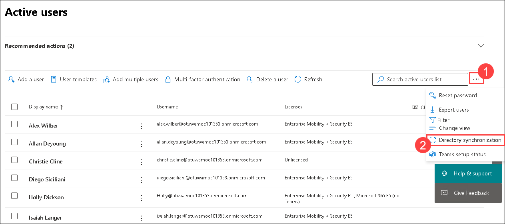
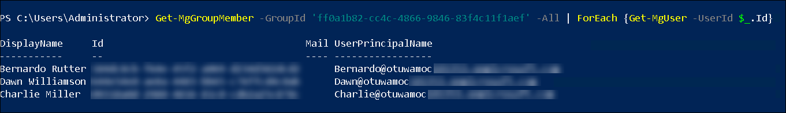

# Learning Path 3 - Lab 3 - Exercise 2 - Implement Identity Synchronization 

## Lab scenario

In this exercise, you will use Microsoft Entra Connect to enable synchronization between Adatum’s on-premises Active Directory and Microsoft Entra ID. Microsoft Entra Connect will then continue to synchronize any delta changes every 30 minutes. You will then make some user and group updates and then manually force an immediate synchronization rather than waiting for Microsoft Entra Connect to automatically synchronize the updates. You will then verify whether the updates were synchronized.   

>**IMPORTANT:** When you start this exercise, you should perform the first four tasks without any delay between them so that Microsoft Entra Connect does not automatically synchronize the changes that you make to the identity objects.

### Task 1: Install Microsoft Entra Connect and Initiate Synchronization

1. You should still be logged into **LON-DC1** as the local **adatum\administrator** from the prior task. 

1. After finishing the previous lab exercise, you should still be logged into Microsoft 365 in your Edge browser as Holly Dickson. If not then enter the URL **https://admin.microsoft.com/** and sign-in with the Holly's account.

1. In your **Edge** browser, select the **Microsoft 365 admin center** tab, and then in the navigation pane, select **Users**, and then select **Active Users**.

1. In the **Active users** window, select the **ellipsis (1)** icon that appears at the end of the menu bar, and then in the drop-down menu that appears, select **Directory synchronization (2)**. This initiates the **Add or sync users to Microsoft Entra ID** wizard.

	

1. In the **Add or sync users to Microsoft Entra ID** wizard, on the **About user synchronization** page, read through the content. In the **User status** section, note the number of existing Adatum cloud users and hybrid users. Select **Next**.

1. On the **Select a migration option** page, read the explanation of each option so that you understand the migration options that are available. Select the **Continuous sync** option and then select **Next**.

1. On the **Prepare by running IdFix** page, since you already ran IdFix in the prior lab exercise, there's no need to download and run it again. Select **Next**.

1. On the **Review synchronization tools** page, Holly had originally planned to select the **Microsoft Entra Connect Sync** option given Adatum's Exchange hybrid deployment. But just to verify that this is the correct solution, Holly has decided to use the system tool that recommends the synchronization tool to use based on your synchronization requirements. Holly will use this feature to verify whether Microsoft Entra Connect Sync is the correct choice for Adatum. 

1. Select **Help me decide**. This option enables you to select from amongst a variety of requirements that your organization may have.  

1. By selecting the **Help me decide** option, the wizard displays a list of predefined requirements that can impact which synchronization tool an organization should use. In the list of requirements that appears, select the following three Adatum requirements to see which sync tool the system recommends (Note how the recommendation either remains the same or changes after selecting each additional requirement): <br/>

	- Select **I require the ability for users to access both on-premises and cloud-based applications using the same passwords (Password hash sync and Password writeback).** 

		>**Note:** After selecting this check box, note the recommendation that appears at the bottom of the page. For this one requirement, the system recommends using **Microsoft Entra Cloud Sync**. <br/>
	
	- Select **I have Exchange on-premises objects that I need to sync to the cloud (Exchange hybrid).**  <br/>

		>**Note:** After selecting this second check box, the recommendation is still **Microsoft Entra Cloud Sync** based on these first two requirements. 

	- Select **I have devices on-premises that I need to access Microsoft Entra ID Hybrid Join.**

		>**Note:** After selecting this third check box, the recommendation changes to **Microsoft Entra Connect Sync**. 

1. Select **Next**. The wizard will deploy the recommended solution, **Microsoft Entra Connect Sync**. 

1. On the **Sync your users** page, select the **Download Microsoft Entra Connect Sync** box. This opens a new tab in your browser and takes you to the Microsoft Download Center.

1. In the **Microsoft Download Center**, a message indicating **Thank you for downloading Microsoft Entra Connect** should appear.

	- If a **Downloads** window appears at the top of the screen, select the **Open file** link that appears below the **AzureADConnect.msi** file once it's finished downloading. <br/>

	- However, if a **Downloads** window doesn't appear at the top of the screen, select the ellipsis icon (three dots) that appears to the right of the **Profile 1** icon (the image of a person inside a circle). In the drop-down menu that appears, select **Downloads**. If a **Downloads** window appears at the top of the screen and it includes the **AzureADConnect.msi** file, then select the **Open file** link that appears below it. However, if **AzureADConnect.msi**  does not appear in the **Downloads** window, then on the **Microsoft Download Center** page, select the **click here to download manually** hyperlink and then repeat this step to open the **AzureADConnect.msi** file.

1. Opening the **AzureADConnect.msi** file initiates the installation of the Microsoft Azure Active Directory Connect Tool by starting the **Microsoft Azure Active Directory Connect** wizard. The first page of the wizard may appear and then suddenly disappear, or it may not appear at all. If either situation occurs, then select the wizard icon on the taskbar.

1. Once download complete open the **AzureADConnect.msi** by clicking on the **Open file**.

	>**Note:** If the file fails to open and it says that TLS 1.2 needs to be enabled, run this command in PowerShell:

	```
	If (-Not (Test-Path 'HKLM:\SOFTWARE\WOW6432Node\Microsoft\.NETFramework\v4.0.30319'))
	{
		New-Item 'HKLM:\SOFTWARE\WOW6432Node\Microsoft\.NETFramework\v4.0.30319' -Force | Out-Null
	}
	New-ItemProperty -Path 'HKLM:\SOFTWARE\WOW6432Node\Microsoft\.NETFramework\v4.0.30319' -Name 'SystemDefaultTlsVersions' -Value '1' -PropertyType 'DWord' -Force | Out-Null
	New-ItemProperty -Path 'HKLM:\SOFTWARE\WOW6432Node\Microsoft\.NETFramework\v4.0.30319' -Name 'SchUseStrongCrypto' -Value '1' -PropertyType 'DWord' -Force | Out-Null

	If (-Not (Test-Path 'HKLM:\SOFTWARE\Microsoft\.NETFramework\v4.0.30319'))
	{
		New-Item 'HKLM:\SOFTWARE\Microsoft\.NETFramework\v4.0.30319' -Force | Out-Null
	}
	New-ItemProperty -Path 'HKLM:\SOFTWARE\Microsoft\.NETFramework\v4.0.30319' -Name 'SystemDefaultTlsVersions' -Value '1' -PropertyType 'DWord' -Force | Out-Null
	New-ItemProperty -Path 'HKLM:\SOFTWARE\Microsoft\.NETFramework\v4.0.30319' -Name 'SchUseStrongCrypto' -Value '1' -PropertyType 'DWord' -Force | Out-Null

	If (-Not (Test-Path 'HKLM:\SYSTEM\CurrentControlSet\Control\SecurityProviders\SCHANNEL\Protocols\TLS 1.2\Server'))
	{
		New-Item 'HKLM:\SYSTEM\CurrentControlSet\Control\SecurityProviders\SCHANNEL\Protocols\TLS 1.2\Server' -Force | Out-Null
	}
	New-ItemProperty -Path 'HKLM:\SYSTEM\CurrentControlSet\Control\SecurityProviders\SCHANNEL\Protocols\TLS 1.2\Server' -Name 'Enabled' -Value '1' -PropertyType 'DWord' -Force | Out-Null
	New-ItemProperty -Path 'HKLM:\SYSTEM\CurrentControlSet\Control\SecurityProviders\SCHANNEL\Protocols\TLS 1.2\Server' -Name 'DisabledByDefault' -Value '0' -PropertyType 'DWord' -Force | Out-Null

	If (-Not (Test-Path 'HKLM:\SYSTEM\CurrentControlSet\Control\SecurityProviders\SCHANNEL\Protocols\TLS 1.2\Client'))
	{
		New-Item 'HKLM:\SYSTEM\CurrentControlSet\Control\SecurityProviders\SCHANNEL\Protocols\TLS 1.2\Client' -Force | Out-Null
	}
	New-ItemProperty -Path 'HKLM:\SYSTEM\CurrentControlSet\Control\SecurityProviders\SCHANNEL\Protocols\TLS 1.2\Client' -Name 'Enabled' -Value '1' -PropertyType 'DWord' -Force | Out-Null
	New-ItemProperty -Path 'HKLM:\SYSTEM\CurrentControlSet\Control\SecurityProviders\SCHANNEL\Protocols\TLS 1.2\Client' -Name 'DisabledByDefault' -Value '0' -PropertyType 'DWord' -Force | Out-Null

	Write-Host 'TLS 1.2 has been enabled. You must restart the Windows Server for the changes to take affect.' -ForegroundColor Cyan
	```

1. On the **Welcome to Microsoft Entra ID Connect** window in the setup wizard, select the **I agree to the license terms and privacy notice** check box and then select **Continue**.

1. On the **Express Settings** page, read the instruction regarding a single Windows Server AD forest and then select **Use express settings**.

1. On the **Connect to Microsoft Entra ID** window, enter **Holly@otuwamoc<inject key="DeploymentID" enableCopy="false"/>.onmicrosoft.com** (where otuwamoc<inject key="DeploymentID" enableCopy="false"/> is the tenant prefix provided by your lab hosting provider) in the **USERNAME** field. In the **PASSWORD** field, enter <inject key="AzureAdUserPassword"></inject>, and then select **Next**. 

	>**Note:** If the **Next** button is not enabled, then tab off the **PASSWORD** field to enable it. 

1. On the **Connect to AD DS** page, enter **adatum\Administrator** in the **USERNAME** field, enter **Pa55w.rd** in the **PASSWORD** field, and then select **Next**.  

	>**Note:** (if the **Next** button is not enabled, then tab off the PASSWORD field to enable it). 

1. In the **Microsoft Entra ID sign-in configuration** window, select the **Continue without matching all UPN suffixes to verified domains** check box at the bottom of the page and then select **Next**.

1. On the **Ready to configure** screen, select the check box for **Start the synchronization process when configuration completes** if it’s not already selected, and then select **Install**.   

	>**IMPORTANT:** While Holly eventually plans install an Exchange hybrid deployment, she will not do so now. For the purpose of this lab, do **NOT** select the **Exchange hybrid deployment** option. 

1. Wait for the configuration to complete (which may take several minutes). On the **Configuration complete** page, select **Exit**. 

1. Select the **Windows (Start)** icon in the lower left corner of the taskbar. In the **Start** menu that appears, select the icon to display all apps. Select **Microsoft Entra ID Connect** to expand the group, and then select **Synchronization Service** to start this desktop application. 

	>**Note:** If you selected **Microsoft Entra ID Connect** in the **Start** menu and it expanded and you were able to select **Synchronization Service**, then proceed to the next step (step 32). However, if **Microsoft Entra ID Connect** did not expand when you selected it in the **Start** menu, then you will need to close all applications and then restart LON-DC1. 

	>**Note:** The remaining instructions in this step are what you should do if you needed to restart LON-DC1. 

1. If you restarted LON-DC1, then after it restarts, follow the instructions from your lab hosting provider to navigate back to hyper-v manager and connect to **LON-DC1** VM. Once connected this will display the log on screen for LON-DC1. Log in as **Adatum\Administrator** with a password of **Pa55w.rd**. 

1. Minimize **Server Manager** after it opens, and then open the **Edge** browser and navigate to **htps://portal.office.com**. Log in as **Holly@otuwamoc<inject key="DeploymentID" enableCopy="false"/>.onmicrosoft.com** (where otuwamoc<inject key="DeploymentID" enableCopy="false"/> is the tenant prefix provided by your lab hosting provider). In the **Password** field, enter <inject key="AzureAdUserPassword"></inject>. 

1. On the **Microsoft Office Home** page, select **Admin** to open the **Microsoft 365 admin center**. Then select the **Windows (Start)** icon in the lower left corner of the taskbar. In the **Start** menu that appears, select **Microsoft Entra ID Connect** to expand the group (this time it should expand), and then select **Synchronization Service**.  

1. Maximize the **Synchronization Service Manager on LON-DC1** window. The **Operations** tab at the top of the screen is displayed by default so that you can monitor the synchronization process, which automatically started when you selected this program. 

1. Wait for the **Export** profile to complete for **otuwamoc<inject key="DeploymentID" enableCopy="false"/>.onmicrosoft.com - AAD**. When it finishes, its **Status** should be **completed-export-errors**. Once it's complete and you see this status, select any of the these **otuwamoc<inject key="DeploymentID" enableCopy="false"/>.onmicrosoft.com - AAD** row.  

1. In the bottom portion of the screen, a detail pane appears showing the detailed information for this selected operation. 

	- In the **Export Statistics** pane on the left, note the number of on-premises users that were added to Azure Active Directory and the number that were updated. 
	- In the **Export Errors** pane on the right, note the errors that appear. If you recall back in the prior lab exercise when you ran the IdFix tool, there were two users with validation errors that you purposely did not fix (**Ngoc Bich Tran** and **An Dung Dao**). 

		Select the first link (CN={xxxxxx...) under the **Export Errors** column that applies to the first **DataValidationFailed** error. This will display the first of these two users that were not synchronized by the Microsoft Entra ID Connect tool. Review the error to see why this account is broken. **Tip:** In the **Connector Space Object Properties** window, select the **Export Error** tab. In the **Error Information** section, select the **Detail** button. Review the detailed error information, and then select **Close**. Select **Close** again. 

		Select the second Data Validation error link and verify this error is for the second user that you purposely did not fix. Follow the same steps as before to review the error for this user.   

	>**IMPORTANT:** Because a synchronization had not been performed prior to this, the initial synchronization was a **Full Synchronization** (see the **Profile Name** column in the top pane). Because the synchronization process will continue to run automatically every 30 minutes, any subsequent synchronizations will display **Delta Synchronization** as its **Profile Name**. If you leave the **Synchronization Service Manager** window open, after 30 minutes you will see that it attempts to synchronize the two users who were not synchronized during the initial synchronization. These will display as a **Delta Synchronization** rather than a **Full Synchronization**.

1. Now that you have seen Microsoft Entra ID Connect complete a Full Synchronization, in the next task you will make some updates and manually force an immediate synchronization rather than waiting for it to synchronize updates every 30 minutes. Close the **Synchronization Service Manager on LON-DC1** window. 

1. In your browser, close all tabs except for the **Home | Microsoft 365** tab and the **Active users - Microsoft 365 admin center** tab. 

1. Leave LON-DC1 open as it will be used in the next exercise.


### Task 2 - Create Group Accounts to Test Synchronization   

>**Important:** Built-in groups are predefined, on-premises security groups that are located under the **Builtin** container in **Active Directory Users and Computers**. They are created automatically when you create an Active Directory domain. You can use these groups to control access to shared resources and delegate specific domain-wide administrative roles. **However, they are NOT synchronized to Microsoft 365, even after adding members to them.** You will validate this functionality in this task.

1. You should still be logged into **LON-DC1** as the **Administrator** from the prior task. 

2. If **Server Manager** is closed, then re-open it now; otherwise, select the **Server Manager** icon on the taskbar. 

3. In **Server Manager**, select **Tools** at the top right side of the screen, and then in the drop-down menu select **Active Directory Users and Computers.**

4. You will begin by adding members to one of the built-in, on-premises security groups. Maximize the **Active Directory Users and Computers** window. In the console tree in the left-hand pane, under **Adatum.com**, select the **Builtin** folder. This will display all the built-in security group folders that were automatically created at the time the **Adatum.com** domain was created.

5. In the detail pane on the right, double-click the **Print Operators** security group.

6. In the **Print Operators Properties** window, select the **Members** tab and then select the **Add** button.

7. In the **Select Users, Contacts, Computers, Service Accounts, or Groups** window, in the **Enter the object names to select** field, type the following names. Type one by one and select **Check names**, click on **OK**, then again select **Add** to check for the another names:  

	- **Ashlee Pickett** 

	- **Juanita Cook** 

	- **Morgan Brooks**  

8. Once they are all validated, select **OK** to return to the **Print Operators Properties** window.

9. In the **Print Operators Properties** window, select **OK** to return to the **Active Directory Users and Computers** window.

10. You will now create a new security group. In the console tree under **Adatum.com**, right-click on the **Research** folder, select **New,** and then select **Group**.  

11. In the **New Object - Group** window, enter the following information:

	- Group name: **Manufacturing**

	- Group scope: **Universal**

	- Group type: **Security**

12. Select **OK**.

13. In the console tree under **Adatum.com**, select the **Research** folder, and then in the detail pane on the right, double-click on the **Manufacturing** security group.  

14. In the **Manufacturing Properties** window, enter **manufacturing@adatum.com** in the **E-mail** field. 

	>**Note:** There are two types of security groups in Microsoft 365: a security group and a mail-enabled security group. By entering a value in the **E-mail** field for this on-premises security group, the synchronization process will create a mail-enabled security group in Microsoft 365.   

15. Select the **Members** tab, and then repeat steps 6-9 to add the following members to this group:  

	- **Bernardo Rutter**

	- **Charlie Miller**

	- **Dawn Williamson**  

16. Leave the **Active Directory Users and Computers** window open for the next task.

 
### Task 3 - Change Group Membership to Test Synchronization  

1. This task continues from where the previous task left off in LON-DC1. In the **Active Directory Users and Computers** window, in the console tree under **Adatum.com**, the **Research** organizational unit is still selected. In the detail pane on the right, double-click the **Research** security group.

2. In the **Research Properties** window, select the **Members** tab to view the members of this group.  

3. You want to remove the following users from the group:

	- **Cai Chu**  

	- **Shannon Booth**  

	- **Tia Zecirevic**  
	
	>**Tip:** While you can remove each user individually, the quickest way is to remove all three at one time. Select the first user, then hold the **Ctrl** key down while scrolling down and selecting the other two. With all three users selected, select the **Remove** button and then select **Yes** to confirm the removal. Verify the three users have been removed, and then select **OK.**

4. Close the **Active Directory Users and Computers** window.
  
5. Leave LON-DC1 open as you will continue using it in the next task. 

	>**Important:** You should perform the next task immediately after completing this one so that Microsoft Entra ID Connect doesn’t automatically synchronize the changes that you just made to the identity objects in the previous tasks.


### Task 4 - Force a manual synchronization   

>**IMPORTANT - PowerShell notice:** The prior lab exercise provided a disclaimer indicating why the tasks in that exercise used the MSOnline module rather than Microsoft Graph PowerShell. While Microsoft is in the process of replacing the two older PowerShell modules, MSOnline and Azure Active Directory (Microsoft Entra ID) PowerShell, with Microsoft Graph PowerShell, there is some functionality in the older modules that has not yet been incorporated into Microsoft Graph PowerShell. The commands in the prior exercise and the command used in this task fall into that category. The prior exercise connected to the MSOnline module, which is also used in this task per the Start-ADSyncSyncCycle command. 

1. On LON-DC1, if the **Windows PowerShell** application is still open from the prior exercise, then **you MUST close it now**.  

	>**WARNING:** The reason for this step is that if Windows PowerShell was opened BEFORE the Microsoft Entra ID Connect setup, the cmdlet **Start-ADSyncSyncCycle** that is used in step 3 will not be available and you will receive an error indicating that the cmdlet is not recognized when you attempt to run it. Therefore, it’s recommended that at this step, you close Windows PowerShell if it’s open.  

2. At this point, Windows PowerShell should NOT be open. You now want to reopen it. To open it, select the **magnifying glass (Search)** icon in the taskbar, type **power** in the Search box, and then in the menu, right-click on **Windows PowerShell** (not Windows PowerShell ISE) and select **Run as administrator**. Maximize the Windows PowerShell window once it opens.

3. In **Windows PowerShell**, run the following command to manually run a sync cycle between Adatum’s on-premises AD and Microsoft Entra ID. The **Delta** switch is used here so that only the updates are synchronized.   

	```powershell
	Start-ADSyncSyncCycle -PolicyType Delta
	```
	
	>**Note:** If for any reason the Domain Controller VM was restarted after the original full synchronization run, the Microsoft Microsoft Entra ID Sync service may not have restarted. If this occurred, you’ll receive an error when you try to perform the forced sync above. If this occurs, you’ll need to start the Microsoft Microsoft Entra ID Sync service first and then perform the forced synchronization.

	>**Note:** If the Start-ADSyncSyncCycle command is not found, the domain controller will need to be restarted for the PowerShell module to complete its installation.
	
4. Once the synchronization process has successfully completed, minimize your PowerShell window (do not close it) and proceed to the next task. You will use PowerShell in the next task to validate some of the results of the directory synchronization.

5. Remain in LON-DC1 and proceed to the next task.
  

### Task 5 - Validate the Results of Directory Synchronization   

>**IMPORTANT - PowerShell notice:** This task employs basic PowerShell queries for Groups and Users, which are supported in Microsoft Graph PowerShell. Since Microsoft Graph PowerShell is replacing the two older PowerShell modules, MSOnline and Azure Active Directory (Microsoft Entra ID) PowerShell, you will use Microsoft Graph PowerShell in this task.

1. You should still be logged into LON-DC1 as the local **adatum\administrator** with a password of **Pa55w.rd.**

2. Now let’s examine the synchronization results for the groups that you updated in the previous tasks. In your **Edge** browser, if tabs are still open for the **Home | Microsoft 365** page and the **Active users - Microsoft 365 admin center**, then proceed to the next step. 

3. Otherwise, enter **https://portal.office.com/** in the address bar to open the **Microsoft 365 Home** page, and then log in as **Holly@otuwamoc<inject key="DeploymentID" enableCopy="false"/>.onmicrosoft.com** (where otuwamoc<inject key="DeploymentID" enableCopy="false"/> is the tenant prefix provided by your lab hosting provider). In the **Password** field, enter <inject key="AzureAdUserPassword"></inject>, and then on the **Microsoft 365 Home** page, navigate to the **Microsoft 365 admin center**. 

3. In the **Microsoft 365 admin center**, select **Teams & groups** in the navigation pane, and then select **Active teams & groups**. 

4. In the **Active teams and groups** window, the **Teams & Microsoft 365 gropus** tab is displayed by default. Select the **Security groups** tab. Verify the **Print Operators** group does NOT appear in the list of security groups. As mentioned previously, built-in security groups such as the **Print Operators** group are not synced from the on-premises AD to Microsoft Entra ID, even when you add members to the group as you did in the earlier task.

5. Verify the **Manufacturing** group appears. This group appears as a mail-enabled security group rather than a standard security group because you added an email address (**manufacturing@adatum.com**) to the on-premises group in the prior task.  

	>**Note:** You may need to wait up to 10 minutes before the **Manufacturing** group appears. Continue to refresh the list until you see the group.  

6. For the **Manufacturing** group, check the value displayed in the **Email** column. Verify the group email address was changed during directory synchronization from **manufacturing@adatum.com** to **manufacturing@otuwamoc<inject key="DeploymentID" enableCopy="false"/>.onmicrosoft.com** (where otuwamoc<inject key="DeploymentID" enableCopy="false"/> is the tenant prefix provided by your lab hosting provider), which is the group's mailbox in Exchange Online.  Hover your mouse over the icon in the **Sync status** column and verify that it indicates **Synced from on-premises**. 

7. To the right of the **Manufacturing** group is a vertical ellipsis icon (three periods vertically aligned). Hold your mouse over this icon. Note the message that appears which indicates you can only manage this group in your on-premises environment. 

8. Now let’s examine this group using Windows PowerShell. If **Windows PowerShell** is already open on the taskbar, then select the PowerShell icon and proceed to the next step; otherwise, type **PowerShell** in the **Search** field on the taskbar and then right-click on the **Windows PowerShell** application and select **Run as administrator**. Maximize your PowerShell window.

9. You should begin by installing Microsoft Graph PowerShell. Earlier in this training, you installed Microsoft Graph PowerShell on LON-CL1. At that time, you installed all 30+ sub-modules by running the following command: Install-Module Microsoft.Graph (where Graph is the parent module that contains the 30+ sub-modules). While you could install all 30+ sub-modules on LON-DC1, you're only going to use the Groups and Users sub-modules in this task, which is the last task in this training that uses PowerShell on LON-DC1. Therefore, to reduce installation time, you'll run the following two commands that will install just those two sub-modules and none of the other 30+ sub-modules. This also provides you with experience in installing specific sub-modules rather than the entire complement of Graph sub-modules.   

	a. Type the following command and press Enter (If you receive a message asking whether you want to install this module from an untrusted repository, enter **A** for **Yes to All**; do the same for the next command as well):  

	```powershell
	Install-Module -Name Microsoft.Graph
	```

	```powershell
	Install-Module Microsoft.Graph.Groups -Scope CurrentUser 
	``` 

	b. At the command prompt, type the following command and press Enter:  

	```powershell
	Install-Module Microsoft.Graph.Users -Scope CurrentUser  
	```

10. Now that you have installed the Groups and Users sub-modules, you must import each of them in order to import their respective cmdlets into your PowerShell session. To do so, you must run the following two commands: 

	a. Type the following command and press Enter:  

	```powershell
	Import-Module Microsoft.Graph.Groups
	```

	a. Then type the following command and press Enter:  

	```powershell
	Import-Module Microsoft.Graph.Users
	```

11. At the command prompt, you must now connect to Microsoft Graph and perform a request for permission to use the Groups and Users cmdlets that were just imported. To complete this task, you only need 'Read only' permissions for these two sub-modules. Type the following command and then press Enter: 
		
	```powershell
	Connect-MgGraph -Scopes 'Group.Read.All', 'User.Read.All'
	```

12. In the **Pick an account** window that appears, select **Holly@otuwamoc<inject key="DeploymentID" enableCopy="false"/>.onmicrosoft.com** (where otuwamoc<inject key="DeploymentID" enableCopy="false"/> is the tenant prefix provided by your lab hosting provider). In the **Enter password** window, enter <inject key="AzureAdUserPassword"></inject> and then select **Sign in**. 

13. If a **Permissions requested** dialog box appears, select the **Consent on behalf of your organization** check box and then select **Accept**.

14. You will now use PowerShell to display the list of groups in Microsoft 365. This list should include the groups that you manually created in Microsoft 365, as well as the groups that were created in the on-premises Active Directory that were just synchronized with Microsoft 365. Type the following command and then press Enter:

	```powershell
	Get-MgGroup | Format-List Id, DisplayName, Description, GroupTypes
	```

15. You now want to display the members of the **Research** group. In the list of groups, highlight the object ID for the **Research** group and then press **Ctrl+C** to copy the ID to the clipboard. Then type the following command, paste in the Research group's object ID (**Ctrl+V**) in the appropriate spot, and then press Enter:  

	```powershell
	Get-MgGroupMember -GroupId 'paste in the group's object ID here'
	```

16. In the list of group members that were displayed in the prior step, note how the results simply show the object ID of each member. Without displaying the user names, this command doesn't help you verify whether the group members were synchronized. To work around this issue, you're going to repeat the prior command, but this time you'll add an additional component that retrieves the User record for each member of the group and displays the User's attributes, which includes the user name. 

	At the command prompt hit the UP arrow on your keyboard. This will automatically type the prior command that was run (which includes the Research group's object ID, so you don't have to re-paste it). Then following the object ID, type the remaining portion of the command (starting with **-All**) and press Enter:

	```powershell
	Get-MgGroupMember -GroupId 'the object ID of the Research group' -All | ForEach {Get-MgUser -UserId $_.Id}
	```

17. In the list of members of the Research group, verify the following users are **NOT** included. Remember, in the prior task you removed these three users from the Research group in the on-premises Active Directory, prior to synchronizing the group to Microsoft 365:  

	- Cai Chu 

	- Shannon Booth  

	- Tai Zecirevic  

18. In the prior task, you added the **Manufacturing** group in the on-premises Active Directory, and you assigned three users to the group. You now want to verify the members of the **Manufacturing** group were synchronized when the group was added in Microsoft 365 during the synchronization process, to do so, you must first scroll back up to the list of groups, highlight the object ID for the **Manufacturing** group and then press **Ctrl+C** to copy the ID to the clipboard. 

19. Then hit the UP arrow on your keyboard to automatically type the prior command, which contains the object ID of the Research group that you pasted in during the prior step:  

	```powershell
	Get-MgGroupMember -GroupId 'the object ID of the Research group' -All | ForEach {Get-MgUser -UserId $_.Id}   
	``` 

	>**Important:** You must then replace the object ID of the Research group with the object ID of the Manufacturing group before running this command. To do so, use the left arrow on your keyboard to move your cursor to the start of the object ID, then highlight the object ID of the Research group and hit **Ctrl+V**. This will replace the ID of the Research group by pasting in the object ID of the **Manufacturing** group. Then press Enter to run the command. Doing so will display the members of the **Manufacturing** group. 

20. In the **Manufacturing** group, you earlier added the following members to the group in the on-premises Active Directory. You should now see each of these group members in this Microsoft 365 group following synchronization:  

	- Bernardo Rutter

	- Charlie Miller

	- Dawn Williamson

		

19. You have now validated that your test groups and user accounts were synchronized properly. Once you have completed the validation steps, close your PowerShell window. 

## Review

In this lab, you have:

- Installed Microsoft Entra ID Connect and Initiate Synchronization.
- Created Group Accounts to Test Synchronization.
- Changed Group Membership to Test Synchronization.
- Force a manual synchronization.
- Validated the Results of Directory Synchronization.

## Proceed to the next exercise.
 
